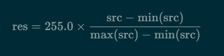
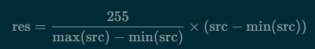
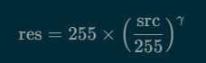
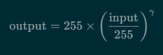
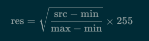
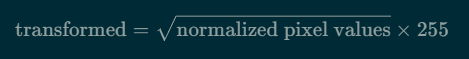
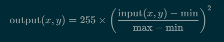

# Linear Histogram Stretching

Vizuális Hatás: 
- A lineáris kiterjesztés során a képen lévő összes szürkeárnyalat egyenlő mértékben eloszlik. A világosabb területek világosabbak lesznek, a sötétebb területek pedig sötétebbek, de a kontraszt növekedése egyenletesen oszlik el.
- Példa: Egy képen a sötét területek kissé világosabbá válnak, de a világos területek is fokozódnak, így az összes szürkeárnyalat megőrzi a viszonyait.

---

# Exponential Histogram Stretching

- Vizuális Hatás: Az exponenciális kiterjesztés során a világosabb területek sokkal világosabbá válnak, míg a sötét területek kevésbé változnak. Ez a torzítás a gamma értékétől függően változik.
- Példa: Ha a gamma értéke kevesebb mint 1, a sötét részek még sötétebbek lesznek, és a világos részek kiemelkednek. Ha a gamma értéke nagyobb mint 1, a sötét területek világosodnak, a világos részek viszont nem változnak annyira.

### Understanding Gamma
- Gamma controls the nature of the transformation:
  - If γ>1, it tends to compress the lower intensities, making the image appear darker.
  - If γ<1, it expands the lower intensities, making the image appear brighter.
  - γ=1 results in a linear transformation, meaning no change in intensity.
### Typical Range of Gamma
- Common values for gamma typically range between 0.1 and 2.5:
  - γ<1 (e.g., 0.5): Emphasizes details in darker regions.
  - γ>1 (e.g., 2.0): Emphasizes details in brighter regions.

The choice of gamma depends on the desired effect and the characteristics of the input image. For images that are too dark, a gamma value less than 1 helps to brighten them. For images that are too bright, a gamma value greater than 1 can darken them to enhance contrast in brighter regions.

---

# Square Root Histogram Stretching / Root Transformation

- A square root stretching a kép sötétebb részeinek kontrasztját növeli. 
- Például egy sötét, árnyékos terület részletei jobban kiemelkednek anélkül, hogy a világos részek túlzottan kivilágosodnának. 
- Ez egy látványosabb eredményt adhat, ha a cél a sötét részek felerősítése.

# Summary

1. Exponential Histogram Stretching
Method: Applies an exponential transformation to the pixel values. Each pixel value is raised to the power of a specified gamma.
Formula: stretched = (normalized_image ^ gamma) * 255, where normalized_image is the pixel values normalized between 0 and 1.
Effect: This technique enhances contrast by brightening lighter regions or darkening darker regions, depending on the value of gamma (e.g., gamma < 1 will brighten shadows).
Use Case: Suitable for images where you want to enhance visibility in certain light ranges (e.g., dark images with subtle details).
2. Linear Stretching
Method: Applies a linear transformation to adjust pixel values between 0 and 255.
Formula: stretched = (255 / (max - min)) * (image - min), where max and min are the maximum and minimum pixel values in the image.
Effect: This method linearly maps the range of pixel intensities to the full 0-255 range, improving overall contrast without altering the relationship between pixel values.
Use Case: Useful when you want to adjust the contrast of an image uniformly without emphasizing specific intensity ranges.
3. Square Root Stretching
Method: Uses the square root of normalized pixel values to adjust contrast.
Formula: stretched = sqrt(normalized_image) * 255, where normalized_image is the pixel values normalized between 0 and 1.
Effect: Enhances contrast in darker regions while maintaining the relative brightness of lighter areas, making dark details more visible without overly brightening the image.
Use Case: Ideal for images where shadow details need to be enhanced, making it easier to see subtle variations in darker parts.

Comparison

Exponential Stretching can be more aggressive in contrast enhancement based on the gamma value.
Linear Stretching evenly adjusts the entire image's contrast.
Square Root Stretching targets dark areas for improvement, making it a middle ground between exponential and linear methods.

---

# Quadratic Histogram Stretching

### Összehasonlítás
- Gyökös transzformáció: az alacsonyabb értékek jobban kiemelkednek, így a sötétebb területek világosabbá válnak, de a világosabb területek kevésbé változnak.
- Négyzetes transzformáció: a világosabb területek kiemelése történik, miközben a sötétebb területek kontrasztja csökken.

Mindkét módszer célja a kép kontrasztjának módosítása, de különböző hatásokat érnek el az egyes területeken.